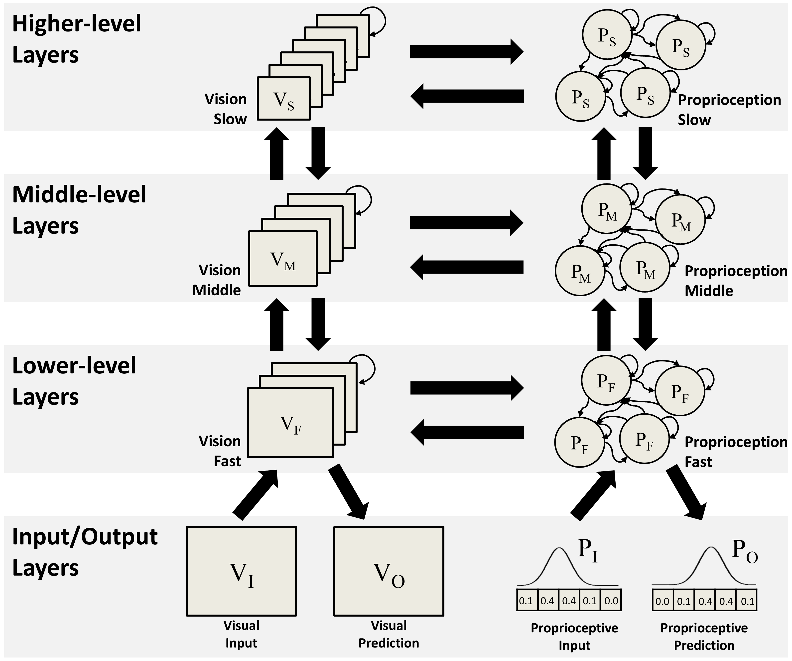
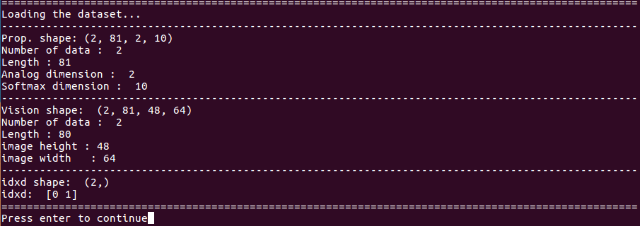
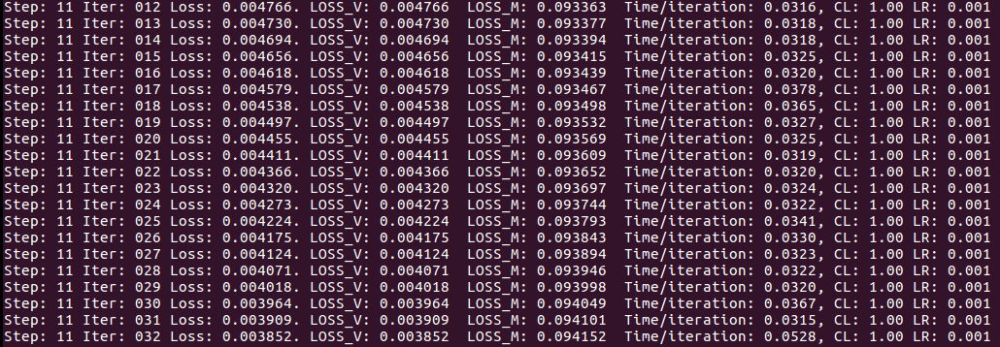

# Predictive Visuo-Motor Deep Dynamic Neural Network (P-VMDNN)

This is the TensorFlow implementation of P-VMDNN (Predictive Visuo-Motor Deep Dynamic Neural Network). For more information about the model, please see the [references](#references).





## Summary

- [Getting Started](#getting-started)
- [Preparing the Dataset](#preparing-the-dataset)
- [Training the Model](#training-the-model)
- [Testing the Model](#testing-the-model)
- [References](#references)
- [Author](#author)
- [Acknowledgements](#Acknowledgments)


## Getting Started
### Prerequisites / Testing Environment
The model was tested under the following environment:

- Ubuntu 16.04 
- Python: 2.7
- TensorFlow: 1.3.0 [[Ref: Installing TensorFlow from Sources]](https://www.tensorflow.org/install/install_sources)
- CUDA: 8.0
- cuDNN: 6.0

Additionally, the following packages are required to train/test the model and to analyze the results.

- numpy
- matplotlib

And this is the IDE that I used for this project.

* [PyCharm Community Edition](https://www.jetbrains.com/pycharm/download/#section=linux)


### Installation

Clone the repository to your working directory.
```shell
git clone https://github.com/mulkkyul/p-vmdnn_tensorflow.git
```

If you quickly want to check whether it's working on your computer, type the following command in the command line.
```bash
python train.py
```
If there's no problem, you'll be able to train the model with the example dataset. If there's a problem, please make sure that you have all the packages mentioned in [Getting Started](#getting-started).


### Files / Directories


*basicPVMDNN.py* contains the functions for P-MSTRNN (visual pathway) and MTRNN (proprioceptive pathway) layers. These functions are called in *pvmdnn_model.py* in which the model structure is defined. If you want to change the structure (e.g. adding/removing a layer in the hierarchy), you can edit *pvmdnn_model.py*. 

The general setting (such as device setting, learning rate, maximum training epoch, etc.) and the network setting (number of neurons, size of the feature map, time constants, etc.) are specified in *settings.ini*. Before you start training/testing the model, make sure that the parameters are correctly set in *settings.ini*.

*train.py* is used for training, *checkTrainResult.py* is used for testing the training result. *entrainment.py* is used for testing (sensory entrainment) and *errorRegression.py* is used for another testing (error regression). 


## Preparing the Dataset 

Dataset is required to train/test the model. This project comes with the example training dataset (*icubOnScreen_4864_minMax1_2.npz*) and the testing dataset (*icubOnScreen_4864_minMax1_er_4.npz*). So if you just want to train/test the model with the example dataset, you can skip this section and go to [Training the Model](#training-the-model). But if you want to use your own dataset, please see below for the instruction.

The P-VMDNN model requires "*Visuo-Motor*" dataset. That is, you need to prepare visual images & joint angles. There are 2 types of dataset used in the experiment.

- Training Dataset: This is used to train the network. Usually, this dataset consists of several training visuomotor sequences. In the example training dataset, there are 2 visuomotor sequences.
- Testing Dataset: This dataset is used to test the network, such as "Sensory Entrainment" and "Error Regression". This dataset only includes 1 testing visuomotor sequence.


### Making the Training Dataset

The example codes for making the training dataset are located under */dataset/example*. To make the *"Visuo-Motor"* dataset, you need to prepare both vision data and motor data. 

##### Vision Data

Under the /vision directory, you can see the vision dataset files. Each file (vision_xxxx.txt) contains a single vision data and you can display them using the matlab code in the same directory. Note that the vision image is in grayscale. In the text file (vision_xxxx.txt), each row is equivalent to the time step (e.g., 80 lines = 80 time steps). So each row is one time step image frame and you can read the sample data using the *displayVisionDataset.m* in the directory. For your information, when the vision data is used in the TensorFlow code, the format is as follow:

- Vision: (N, L, H, W): 
  - N: Number of Data / L: Length / H: Height of the Image / W: Width of the Image

##### Motor Data

Under the /motor directory, you can see the codes and samples for making motor dataset. In the analog directory, there are 2 samples (target_JNT3_LR_xxxx.txt) which contains the trajectory of the robot's joints (left and right elbows). Each row is equivalent to the time step (e.g., 80 lines = 80 time steps) and each column corresponds to the joints.

In our code, we used the sparse encoding of motor data to improve training. That is, each analog dimension (joint angle) is encoded into a set of softmax neurons. Therefore, you need to transform those analog values into the softmax representation and it can be done by using *softmaxTransform.m* in the directory. if you run the matlab code, it'll generate softmax directory and store the softmax transformed values and also inversely transformed values (softmax -> analog). So you can check whether softmax transform is successfully done by comparing the original analog files (target-JNT3-LRxxxx.txt) and the inversely transformed files (target-xxxx-inverse.txt). If you open the target-xxxx-softmax.txt, it should have the same number of lines but with more columns (it should be number-of-analog-dim x number-of-softmax-units). For your information, when the motor data is used in the TensorFlow code, the format is as follow:

- Motor (N, L, D, SD)
  - N: Number of Data / L: Length / D: Analog Dimension (number of joints) / SD: Softmax Dimension (number of softmax units per Analog Dimension)

##### Making a NPZ file

Once you have both vision and motor data, you can proceed to make a dataset file for TensorFlow. Please make sure that you have the vision and the motor data in each directory. Then, you can run the following python code to make a npz file.

```shell
python makeNumpyDataset.py
```

If there's no problem, you will see a screen something like this:


### Making the Testing Dataset

This section will be updated in later.


## Training the Model
First, check *settings.ini* to configure the model for training. In this example, the model will be trained for 100,000 epochs. Note that there are more parameters in *settings.ini*. 

```ini
# The GPU card will be used (highly recommended)
device: /gpu:0 
# At every 10th epoch, the results (MSE, computation time) will be printed on the screen & logged in loss.txt in the log_dir. 
print_epoch: 10
# At every 1000th epoch, the results (log_fn_epoch) will be saved in the log_dir.
saveNetwork_epoch: 1000
# if the training loss is smaller than this value, we want to save the network!
loss_minTH = 0.005
# We trained the model from the scratch (i.e. we don't have any trained network now!)
restoreNetwork: 0
# learning rate = 0.001
lrate: 0.001
# The training will be stopped at 100,000th epoch
max_epoch: 100000
```

Once you configure the *settings.ini*, you can start training.
```bash
python train.py
```

Then, it will show some information on the screen, including the size of training dataset, the parameter setting of the model, etc. Press enter several time when it asks. 



If there's no problem, the training will start and you can see the training logs on the screen (every 10th epoch). In my computer (Intel i7, 32GB RAM, GTX 1080Ti), training the model for 100,000 epochs took me 11 hours.


### Check the training results
Once the training is completed, you can check the training results. In this example, I'll check the result from the network from the last training epoch (100,000). In *settings.ini*, I specified the parameters as follow.
```ini
# I'll check the network from 100,000th epoch
restoreNetworkEpoch: 100000
```
To check the training result, run the following command in the command line:

```bash
python checkTrainResult.py
```

This code will save the training results in the log_dir. In the *initStates* directory, the initial states will be saved. In *outputs* directory, the model outputs (both vision and proprioception) as well as neuron activation will be saved. After it saves the results, it plots the outputs like below:


")


")


## Testing the Model

There are two types of testing used in the study. The first method is called "**Sensory Entrainment**" which doesn't have prediction error minimization. In this method, the sensorimotor input from the external world (such as camera, encoders) drives the neuronal activation of the model. Another method is called "**Error Regression**" which has the prediction error minimization. In this method, the internal states of the neurons are updated to minimize the Prediction Error. If you want to find out more details about these methods, please refer the [references](#references).


### Testing - Sensory Entrainment
In this example, it is assumed that the model was trained for 100,000 epoch. In the Sensory Entrainment case, there are not many parameters that you should specify.  Make sure that you have specified the following parameters correctly in *settings.ini*. 

```ini
# The epoch that you want to test. 100,000 in this example.
restoreNetworkEpoch: 100000
# In the example training dataset, there were 2 visuomotor sequences
originalNumberOfPrimitives: 2
# The name of the testing dataset under data_dir
data_fn_testing: icubOnScreen_4864_minMax1_er_4.npz
```

Once you configure the *settings.ini*, you can start sensory entrainment as follow:

```shell
python entrainment.py
```

After the computation for sensory entrainment is completed, the program will save and plot the results. Usually, the computation of sensory entrainment is very cheap (only forward dynamics), so it can be computed quickly (less than a few seconds). 


### Testing - Error Regression 

In this example, we will use the same network (the one from 100,000th epoch). In the Error Regression case, there are a few more parameters that you need to specify in *settings.ini*. 

```ini
# The epoch that you want to test. 100,000 in this example.
restoreNetworkEpoch: 100000
# In the example training dataset, there were 2 visuomotor sequences
originalNumberOfPrimitives: 2
# The name of the testing dataset under data_dir
data_fn_testing: icubOnScreen_4864_minMax1_er_4.npz
# During the ERS, we have to specify which prediction error will be minimized.
# In this example, the model will try to minimize visual prediction error.
lossType: 1
# During the ERS, the model's internal states are updated 50 times at each time step.
numIterations: 50
# The window size in the ERS is set to 20.
windowLength: 20
# If true (1), the layer's states are also saved (it's very slow)
ers_save_verbose = False
```

Once you configure the *settings.ini*, you can start error regression as follow:

```shell
python errorRegression.py
```

Unlike Sensory Entrainment, the computation for Error Regression is quite demanding. The computational cost is also depending on some parameters, such as *numIterations* and *windowLength*. If the Error Regression Scheme is working properly, you will see a screen like below:



After the computation is completed, the program will save and plot the results. Note that the performance of the model during the ERS will depend on the parameter settings (*numIterations* and *windowLength*).


## References
- Hwang, J., Kim, J., Ahmadi, A., Choi, M., & Tani, J. (2018). Dealing with Large-Scale Spatio-Temporal Patterns in Imitative Interaction between a Robot and a Human by Using the Predictive Coding Framework. Accepted in the *IEEE Transactions on Systems, Man and Cybernetics: Systems (SMC)*. [[PDF]](https://oist-prod-groups.s3-ap-northeast-1.amazonaws.com/s3fs-public/imce/u103429/HWANG_SMC_revision2_20180109_PDF_clean.pdf)
- Hwang, J., Kim, J., Ahmadi, A., Choi, M., & Tani, J. (2017). "Predictive Coding-based Deep Dynamic Neural Network for Visuomotor Learning". Presented at the *7th Joint IEEE International Conference of Developmental Learning and Epigenetic Robotics* (ICDL-EpiRob 2017, Lisbon, Portugal) [[arXiv]](https://arxiv.org/abs/1706.02444)
  - Presentation Slides [[Link]](https://mulkkyul.github.io/2017/10/10/cogRobot-icdl2017/)


## Author

* Jungsik Hwang - mulkkyul@gmail.com, https://mulkkyul.github.io


## Acknowledgments

* Jinhyung Kim, from Korea Advanced Institute of Science and Technology (KAIST), Republic of Korea


